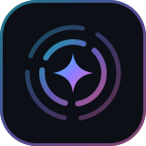

# Support Sensorium

Sensorium is free and open source, built by one person on nights and weekends. If it helps you, whether by tidying a
decade of files, keeping your socials going while you make things, or just giving you one calm place for everything,
a donation keeps it moving.

  

**PayPal:** [paypal.me/noodlebake](https://www.paypal.com/paypalme/noodlebake) (@noodlebake)

## Where it goes

- Time to fix bugs and answer issues
- Testing against real services (AI APIs, social APIs, cloud accounts)
- New connectors and features from the [ideas list](README.md#-status)

Donations are a thank-you, not a purchase: they don't come with support contracts or perks, and Sensorium stays
AGPL-licensed and free for everyone either way.

## Other ways to help

- ⭐ Star the repo and share it with someone who has files everywhere
- 🐛 Report bugs, especially with real accounts and models
- 💡 Suggest connectors and features in the issues
- 💜 Support **[Filestash](https://www.filestash.app)**, the project Sensorium is built on
