<p align="center">
  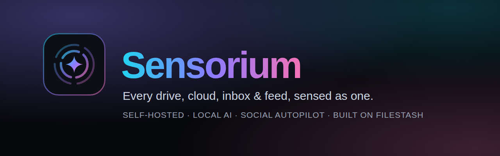
</p>

<p align="center">
  <b>Your self-hosted command center for every drive, cloud, inbox, calendar and social account.<br>
  With a private AI that searches, sorts, de-duplicates, and posts for you.</b>
</p>

<p align="center">
  <a href="LICENSE"></a>
  
  
  
  
  <a href="DONATE.md"></a>
</p>

<p align="center">
  <a href="#-quick-start">Quick start</a> ·
  <a href="#-what-it-does">Features</a> ·
  <a href="#-the-assistant">Assistant</a> ·
  <a href="#-social-autopilot">Social autopilot</a> ·
  <a href="#-bring-your-own-agent">Agents &amp; MCP</a> ·
  <a href="#-built-on-filestash">Credits</a> ·
  <a href="DONATE.md">Donate</a>
</p>

---

Your stuff is everywhere: two Dropbox accounts, a couple of Google Drives, iCloud, an external drive, your phone,
three inboxes, a calendar, and the social accounts you post your work to. **Sensorium puts all of it in one place you
own**, running on your own computer, and adds an assistant that can actually *do* things: find the file you're thinking
of, clean up your Downloads, spot duplicates across accounts, and turn a folder of photos into a posting schedule.

No subscription and no cloud middleman. Your files never leave your machine unless you choose a hosted AI model.

<p align="center">
  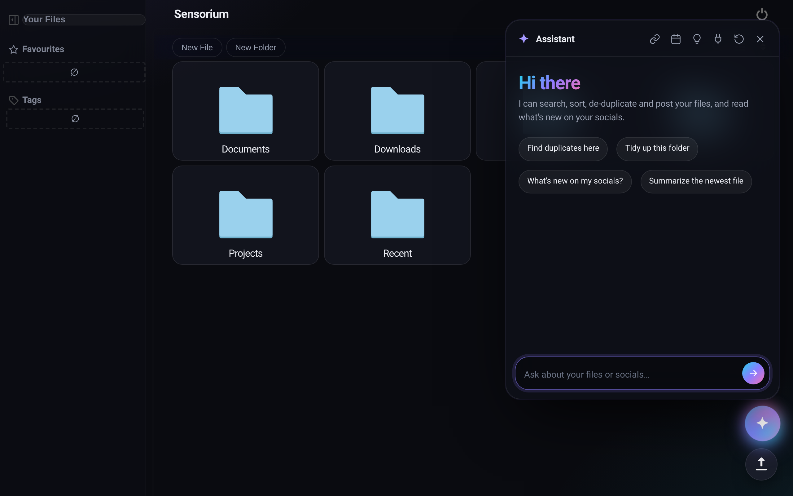
</p>

## 🎬 See it in action

<table>
  <tr>
    <td width="50%">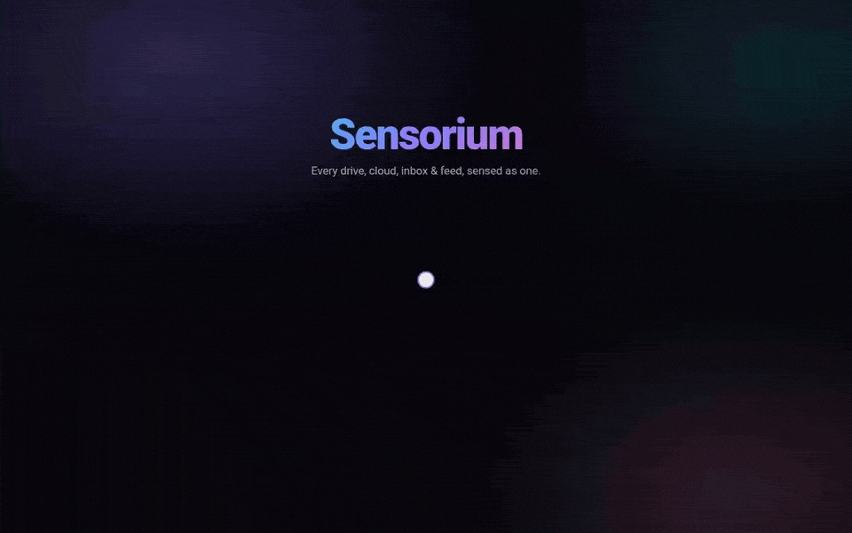<br><sub><b>Sign in &amp; browse</b>: one password, then your whole library.</sub></td>
    <td width="50%">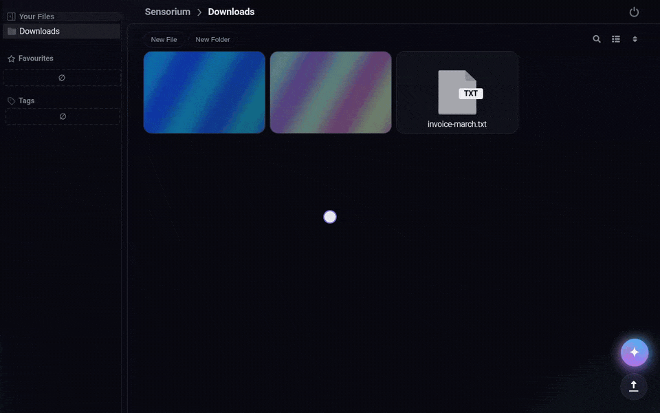<br><sub><b>"Clean up my Downloads"</b>: files sorted, duplicate caught, deleted only on your click.</sub></td>
  </tr>
  <tr>
    <td width="50%">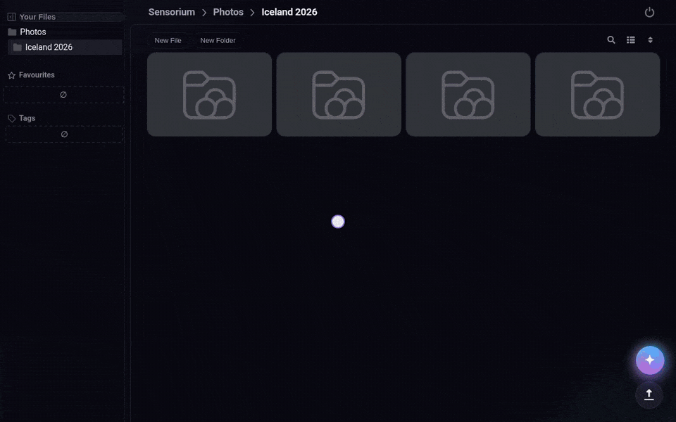<br><sub><b>Social autopilot</b>: a weekly routine, a draft, one click to publish.</sub></td>
    <td width="50%">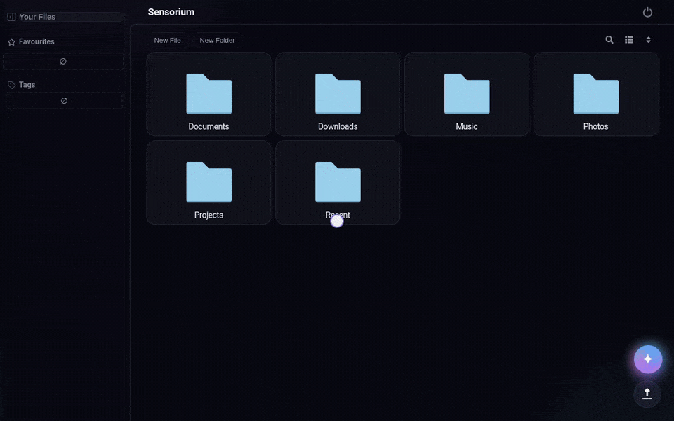<br><sub><b>One inbox</b>: replies, mentions and DMs in one answer.</sub></td>
  </tr>
</table>

<sub>Recorded live in the app on a demo library. The assistant's replies come from a scripted demo model; the actions
(sign-in, moves, the duplicate check, the delete, the routine, publishing through the Bluesky API) were really performed
by Sensorium.</sub>

## ✦ What it does

| | |
|---|---|
| 🗂️ **One place for every storage** | Local disks, external drives, other computers (SFTP/SMB), phones (WebDAV), S3, and **any of rclone's 70+ clouds**: iCloud Drive, OneDrive, Box, and as many Dropbox / Google Drive accounts as you have. |
| ✉️ **Email & calendar as files** | IMAP mailboxes show up as folders of `.eml` files, and CalDAV calendars as folders of `.ics` events. Browse, search, move and let the AI read them like anything else. |
| ✦ **An assistant that acts** | Search by name or by content, read, summarize, rename, move, create folders, find exact duplicates. It runs on a **local model** (Ollama) or any OpenAI-compatible API. |
| 🧠 **Memory that grows** | It remembers your preferences and conventions ("invoices go in /Documents/Invoices") and learns from what it did before. You can review and delete memories at any time. |
| 📣 **Social autopilot** | Bluesky, Mastodon, Instagram and YouTube: drafts, scheduled posts, and one inbox for replies, mentions, DMs and comments. **Routines** turn the next file of a folder into a post on a schedule, with a caption written in your voice. |
| 🔌 **Bring your own agent** | A built-in MCP server (SSE and Streamable HTTP) lets DeepSeek Harness, Hermes Agent, Claude Desktop and other MCP clients work on your files, locked to the folder you choose. |
| ⚡ **Jev fast-path** *(optional)* | With a [TypeSafe Jev](https://typesafe.ai) key, sorting hundreds of files and triaging notifications takes a fraction of a second per item. |
| 🌙 **A modern look** | A dark, glassy interface with gradient accents, designed to feel calm and quick. |

<table>
  <tr>
    <td width="50%">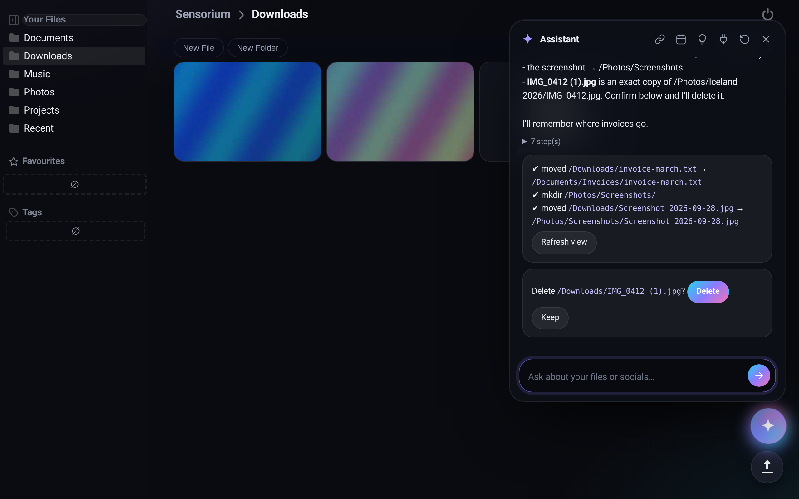<br><sub><b>"Clean up my Downloads"</b>: moves an invoice next to the others, files a screenshot, finds an exact duplicate and asks before deleting it.</sub></td>
    <td width="50%">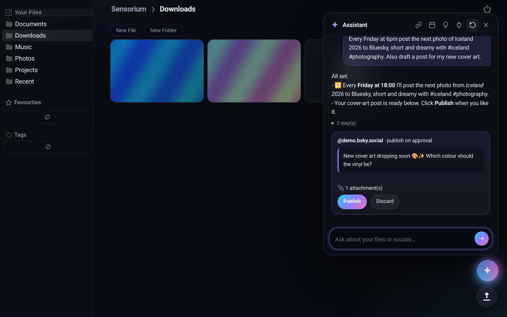<br><sub><b>Social autopilot</b>: a weekly routine from a photo folder, plus a draft that waits for your click.</sub></td>
  </tr>
  <tr>
    <td width="50%">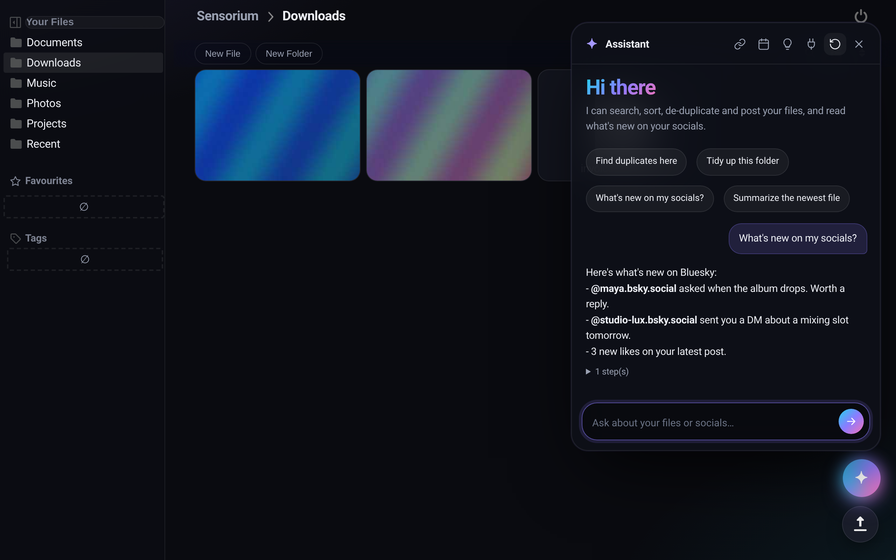<br><sub><b>"What's new on my socials?"</b>: replies, mentions and DMs across accounts.</sub></td>
    <td width="50%">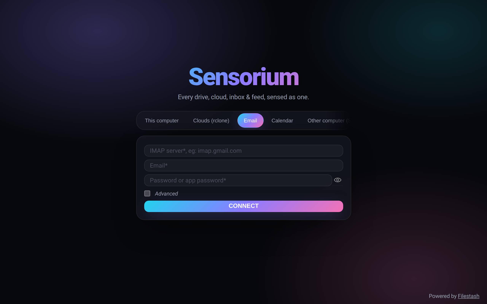<br><sub><b>Every source, one sign-in page</b>: this computer, clouds, email, calendar, other computers, phones.</sub></td>
  </tr>
</table>

<sub>The screenshots show the real app on a demo library. The assistant's words in them come from a scripted demo
model, but every action shown (moves, the duplicate check, drafts, routines, the Bluesky inbox) was actually carried out
by Sensorium.</sub>

## 🚀 Quick start

You need [Docker Desktop](https://www.docker.com/products/docker-desktop/). For fast local AI, have **LM Studio**
(with its server started) or the [Ollama app](https://ollama.com/download) running. The start script finds either one,
or runs Ollama in Docker for you.

```sh
git clone https://github.com/RhythrosaLabs/sensorium.git
cd sensorium/home
./start.sh                                              # macOS / Linux
powershell -ExecutionPolicy Bypass -File .\start.ps1    # Windows
```

The script checks Docker, then uses LM Studio or the Ollama app if one is running (otherwise it starts Ollama in Docker
and downloads the model). It then builds Sensorium and opens **http://localhost:8334**. The first run takes 5 to 15 minutes; after
that it starts in seconds.

1. Choose an admin password.
2. Open http://localhost:8334/login, pick **This computer**, and enter that password.
3. Click ✦ (or press <kbd>ctrl</kbd>+<kbd>k</kbd>) and ask for something.

Add clouds with `./rclone-config.sh` (iCloud, Dropbox, Google Drive, OneDrive…), and email, calendar, other computers
and phones from the login page. Full walkthrough and settings: **[home/README.md](home/README.md)**.

## ✦ The assistant

Things to ask:

- *"Find duplicates in my Photos and tell me how much space I'd get back."*
- *"Sort my Downloads into Invoices, Photos, Code and Other."*
- *"Which contract mentions a 30 day notice period?"* (searches inside documents)
- *"Summarize the newest file in this folder."*
- *"Rename these scans with the date they were taken."*

**What it can do:** list, read, search by name, search inside documents (full-text index), find duplicates (size +
SHA-256), create folders, move and rename, classify many files at once (with Jev), remember and forget.

**Guardrails:**

- It acts as **you**, through the same permission checks as the rest of the app, and only inside the storage you're
  signed in to.
- **Nothing is ever deleted without your click.** Deletions come back as a confirmation button.
- Every move and rename is listed in the chat, so you can see exactly what changed.
- People who open a public share link don't get the assistant, its memory or your accounts.

**Models:**

| | Setting | Notes |
|---|---|---|
| Local, free | LM Studio or Ollama: `qwen3:8b` (default), `qwen3:14b`, `hermes3`, `llama3.1` | Pick a model with the **tools** tag. For routines that describe photos, a vision model like `qwen2.5vl` or `gemma3` sees the image. |
| Hosted | DeepSeek (`https://api.deepseek.com/v1`, `deepseek-chat`), OpenRouter, any OpenAI-compatible API | Faster on small machines; your prompts then go to that provider. |

## 📣 Social autopilot

| Network | Posting | Inbox | Setup |
|---|---|---|---|
| **Bluesky** | text, up to 4 images, clickable links | notifications and DMs | app password |
| **Mastodon** | text, images, video | notifications, DMs | access token |
| **Instagram** | photos, carousels, reels | comments on recent posts | Business/Creator account plus a Meta token; your instance must be reachable from the internet |
| **YouTube** | video uploads (streamed, up to 4 GB), title and description | comments on your latest videos | one-time Google OAuth client, then "Sign in with Google" |

- **Drafts first.** Anything the assistant writes waits for your **Publish** click, now or at a scheduled time.
- **Routines.** *"Every Monday and Thursday at 6pm, post the next photo of /Art to Instagram, short, add #art."*
  Sensorium picks the next unposted file, writes the caption (looking at the image with a vision model), and
  publishes it, or saves it as a draft if you asked to review first.
- **One inbox.** *"What's new on my socials?"* gathers replies, mentions, DMs and comments across accounts. With Jev,
  each item is marked "needs a reply" with an urgency level.

Credentials are verified when you connect, stored encrypted, and never sent to the AI model. Setup guides:
[plg_widget_ai/README.md](server/plugin/plg_widget_ai/README.md).

## 🔌 Bring your own agent

Sensorium includes an MCP server with both the SSE transport and the newer **Streamable HTTP** transport (`/mcp`).
Click the plug icon in the assistant to get a token and ready-to-paste configs:

```sh
# DeepSeek Harness: save the generated filestash.cordis.yml, then
npx @deepseek-ai/dsh web --patch "$PWD/filestash.cordis.yml"
```

Any MCP client that speaks Streamable HTTP works the same way (Hermes Agent, Claude Desktop, your own scripts).
Agents are **confined to the folder of the session the token came from**.

## 🧭 How it fits together

```mermaid
flowchart LR
  subgraph Sources
    A[This computer / drives] --- B[rclone: iCloud, Dropbox ×N, Drive ×N, OneDrive…]
    B --- C[Email IMAP] --- D[Calendar CalDAV] --- E[SFTP · SMB · WebDAV · S3]
  end
  Sources --> F[Sensorium<br/>file manager core]
  F --> G[✦ Assistant<br/>tools · memory · guardrails]
  G <--> H[(Local model<br/>Ollama)]
  G -. optional .-> I[Hosted model / Jev]
  G --> J[Social autopilot<br/>Bluesky · Mastodon · Instagram · YouTube]
  F --> K[MCP server<br/>SSE + Streamable HTTP]
  K --> L[DeepSeek Harness · Hermes · Claude…]
```

Everything is a plugin, in the spirit of Filestash:

| Plugin | What it adds |
|---|---|
| `plg_widget_ai` | the assistant, memory, social autopilot, Jev, the agent connect button |
| `plg_backend_rclone` | any rclone remote as storage |
| `plg_backend_imap` | email as files |
| `plg_backend_caldav` | calendars as files |
| `plg_handler_mcp` | Streamable HTTP transport and folder confinement, added to Filestash's MCP server |
| `plg_theme_sensorium` | the dark interface |
| *(enabled from Filestash)* `plg_search_sqlitefts`, `plg_widget_recent`, `plg_widget_favourite`, `plg_video_thumbnail` | full-text search, recent files with AI search, favourites, video thumbnails |

## 🔒 Privacy & security

- **Self-hosted.** Runs on your machine in Docker, as a non-root user.
- **Local AI by default.** With Ollama, nothing leaves your computer.
- **Secrets encrypted at rest.** Social credentials and the sessions saved for routines are encrypted with the
  instance key.
- **Least privilege for agents.** MCP tokens are locked to the folder the session was opened on, and path escapes are
  rejected.
- **Human in the loop.** No deletion without a click. Posts written by the assistant are drafts until you approve them.

## 📍 Status

Sensorium is a young personal project, shared as-is. What has been verified:

- The full app builds and runs. First-run setup, login, the assistant, the theme and the MCP endpoints were tested end
  to end in a real browser, using the same Docker Compose setup as `home/` with a locally built binary. The Docker
  image build itself mirrors Filestash's official Dockerfile but hasn't been run end to end yet.
- Every new plugin has automated tests: rclone against a real rclone binary, email and calendar against real
  IMAP/CalDAV server libraries, and the assistant, social networks, YouTube, Jev and MCP against faithful fakes of
  their APIs, including a race-detector run.
- The MCP endpoint was tested with the official MCP client libraries, including the exact one DeepSeek Harness uses.

**Not yet verified against the live services:** real AI models, and real Bluesky / Mastodon / Instagram / YouTube /
Jev accounts. If something breaks with a real account, please open an issue.

**Not supported (yet):** Google Calendar (needs its own OAuth flow), Instagram DMs (needs Meta app review), X/Twitter
(paid API).

**Ideas for later:** a GitHub backend covering all your repos, Canva designs as files, Threads / TikTok / LinkedIn, a
daily digest of your socials.

## 🛠️ Development

```sh
go test ./server/plugin/plg_widget_ai/ ./server/plugin/plg_backend_rclone/ \
        ./server/plugin/plg_backend_imap/ ./server/plugin/plg_backend_caldav/ \
        ./server/plugin/plg_handler_mcp/ ./server/plugin/plg_theme_sensorium/
```

The complete build needs the image and video libraries listed in [home/Dockerfile](home/Dockerfile). The simplest way
to build is the Docker setup in `home/`.

## 💜 Built on Filestash

Sensorium stands on the shoulders of **[Filestash](https://github.com/mickael-kerjean/filestash)** by
**Mickael Kerjean** and contributors: a superb, storage-agnostic file manager with a plugin architecture that made all
of this possible. The file manager, the storage connectors, the viewers, the workflow engine, the MCP server and the
core UI are theirs. Sensorium adds plugins, a theme and a home setup on top.

If you need a rock-solid file manager for your team, or enterprise features and support, go straight to the source:
**[filestash.app](https://www.filestash.app)**. The original README is kept at
[docs/FILESTASH_README.md](docs/FILESTASH_README.md), and the details of what changed are in [NOTICE.md](NOTICE.md).

## 📄 License

[AGPL-3.0](LICENSE), like Filestash. You can use, study, change and share Sensorium. If you run a modified version
as a service for others, you must offer them its source code.

## ☕ Support

Sensorium is made on nights and weekends. If it saves you time or makes your creative life easier, you can support it
here:

<p align="center">
  <a href="https://www.paypal.com/paypalme/noodlebake"></a>
</p>

More on the [donation page](DONATE.md). Starring the repo and sharing it helps too. ⭐

---

<p align="center">
  <sub>#selfhosted #homelab #localai #ollama #ai #aiagents #mcp #filemanager #privacy #opensource #golang #docker
  #rclone #icloud #dropbox #googledrive #bluesky #mastodon #instagram #youtube #creators #automation #productivity #deepseek</sub>
</p>
